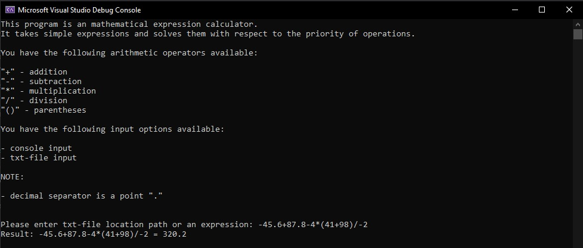
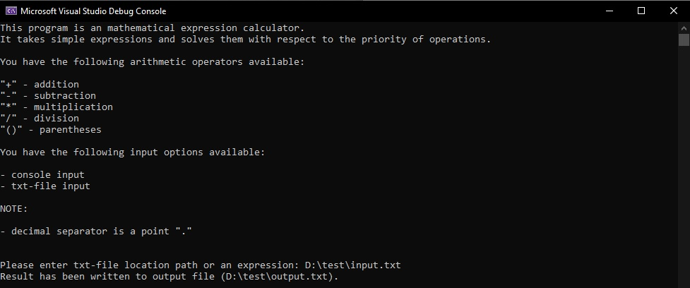
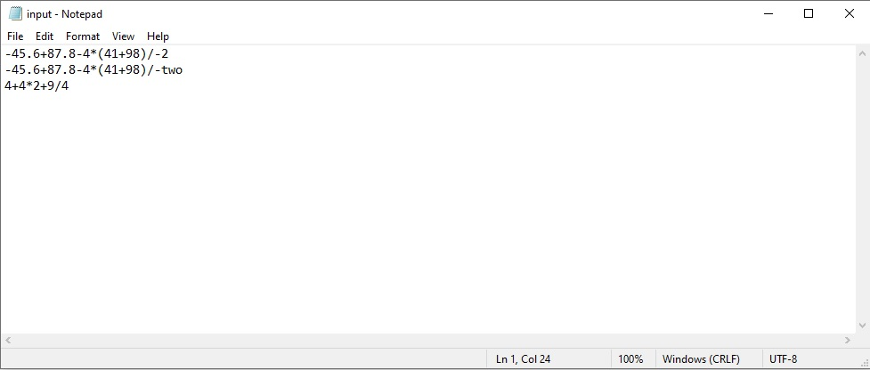
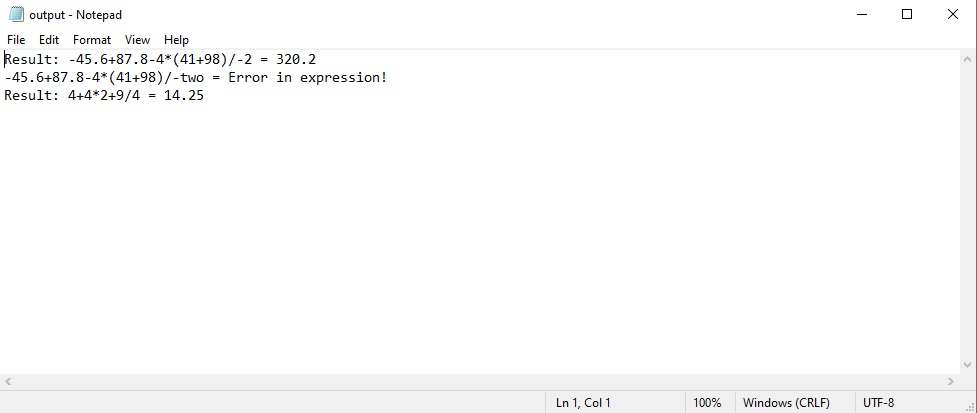

# mathematical_expressions_calculator_mongoDb
A simple mathematical expression calculator. It takes simple expressions and solves them with respect to the priority of operations. This project is an add-on for one of my previous projects(https://github.com/geoGitAm/mathematical_expressions_calculator).

This application has the following architecture:

- Presentation layer: Console Application (C#, .NET Core);
- Business layer: Class Library (C#, .NET Core);
- Data layer 1: Txt-file;
- Data layer 2: MongoDb database.

There are some additional project details (architecture, technologies/patterns used, etc.):
- Logging (Serilog, sinks: debug, text-file);
- Dependency injection (Autofac);
- Reverse polish notation conversion algorithm (using stack);
- Postfix notation expression evaluation algorithm (using stack);
- Repository pattern;
- Observer pattern;
- Txt-file input/output;
- Unit-tests (MSTest).

# Demo (expression input):

# Demo (txt-file input):

Txt-file path input

Input file

Output file
